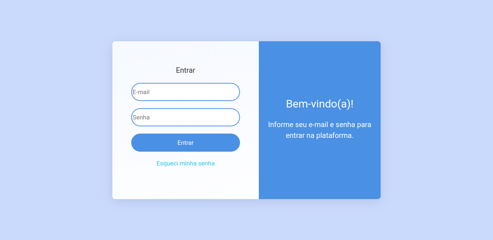
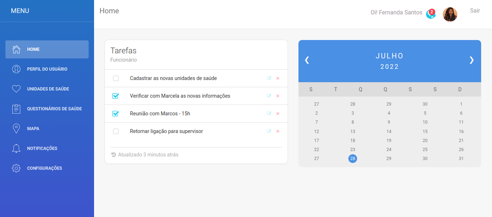
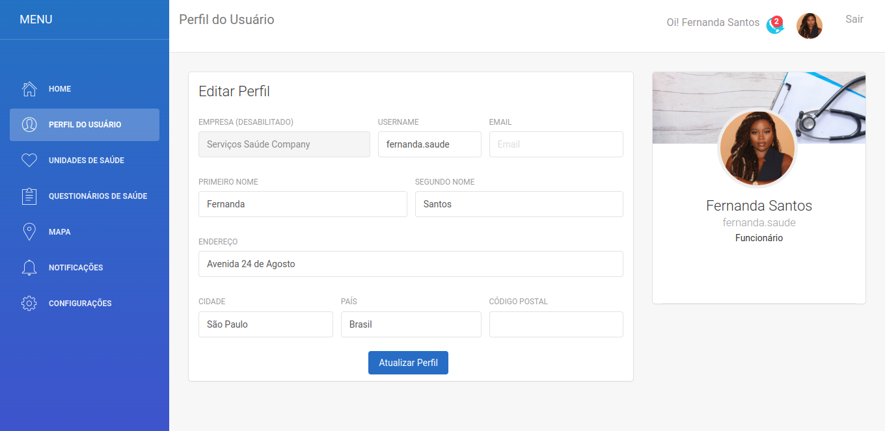
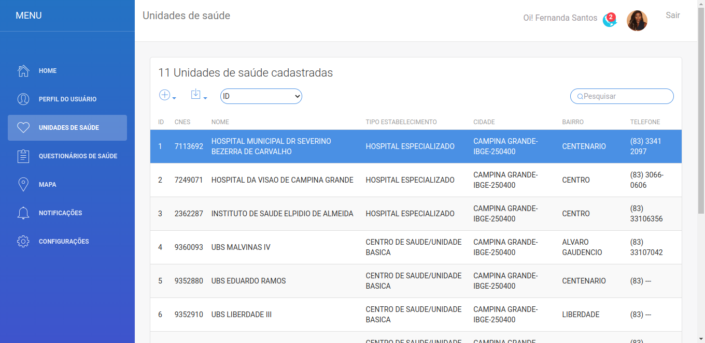
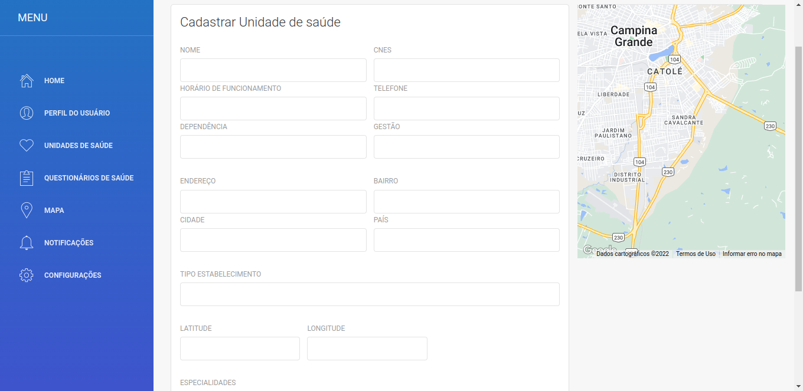
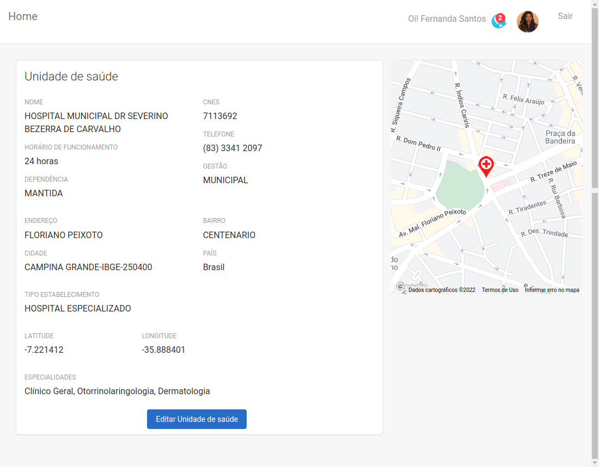
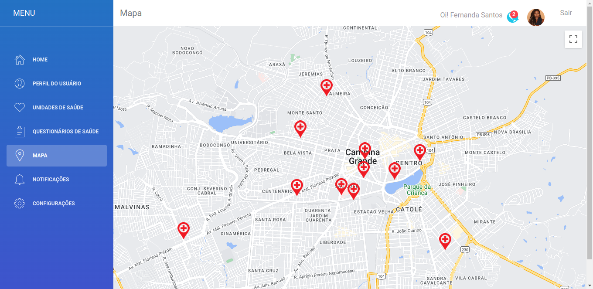

# Sistema Web - CRUD - Front end

Sistema desenvolvido para TCC II - UEPB - 2022.1.


Front end de um CRUD desenvolvido utilizando Angular, para gerenciar unidades de saúde que serão disponibilizadas no aplicativo (Ionic + Angular), sendo o aplicativo desenvolvido também para o TCC II.

Repositório do app: https://github.com/Danieleventura/appServicoSaude


## Primeiros passos:

1-Clone este repositório: git clone https://github.com/Danieleventura/crud-servico-saude.git.

2-Rode ```npm install``` no root do projeto.

3-Rode ```ng serve``` em um terminal no root do projeto.


## Configuração google-map:

1- Informar sua ***google-map key*** no arquivo ***user-layout.module.ts*** e ***app.module.ts*** .



--------------------------------------------------------------


--------------------------------------------------------------


--------------------------------------------------------------


--------------------------------------------------------------


--------------------------------------------------------------


--------------------------------------------------------------


--------------------------------------------------------------
